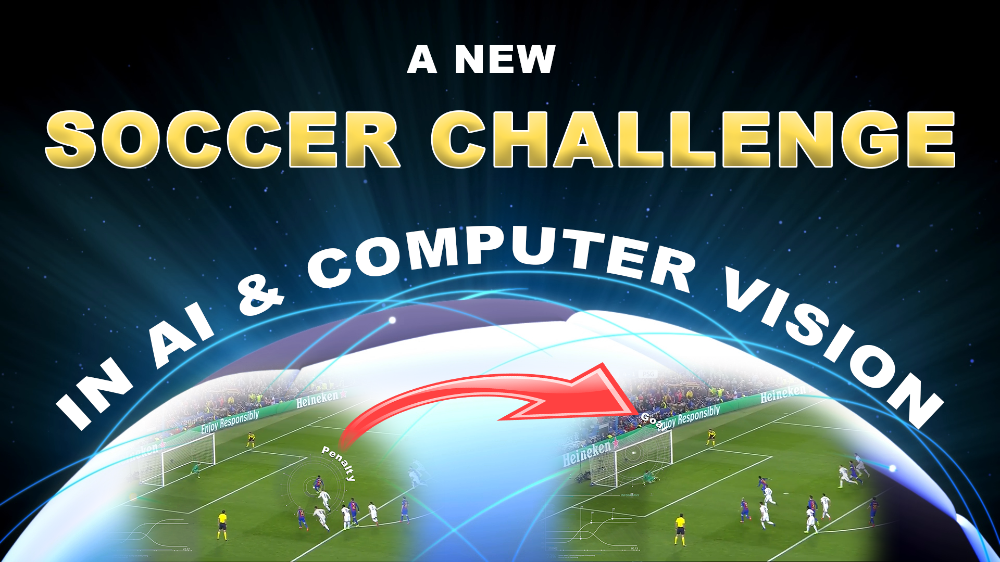

# SoccerNet - Replay Grounding

Welcome to the SoccerNet Development Kit for the Replay Grounding Task and Challenge. This kit is meant as a help to get started working with the soccernet data and the proposed task. More information about the dataset can be found on our [official website](https://soccer-net.org/).

SoccerNet Replay Grounding is part of the SoccerNet-v2 dataset, which is an extension of SoccerNet-v1 with new and challenging tasks including
action spotting, camera shot segmentation with boundary detection, and a novel replay grounding task.

<p align="center"></p>

The Action Spotting dataset consists of 500 complete soccer games including:
 - Full untrimmed broadcast videos in both low and high resolution.
 - Pre-computed features such as ResNET-152.
 - Annotations of camera changes and replays with live action spot (Labels-cameras.json).

Participate in our upcoming Challenge in the [CVPR 2022 International Challenge on Activity Recognition Workshop](http://activity-net.org/challenges/2021/index.html) and try to win up to 500$ sponsored by [SportRadar](https://www.sportradar.com/)! All details can be found on the [challenge website](https://eval.ai/web/challenges/challenge-page/761/overview), or on the [main page](https://soccer-net.org/).

The participation deadline is fixed at the 30th of May 2022.
The official rules and guidelines are available on [ChallengeRules.md](ChallengeRules.md).

<a href="https://youtu.be/T8Qc39FcQ7A">
<p align="center"></p>
</a>

### 2021 Challenge leaderboard

This table summarizes the current performances on the 2021 challenge. 
For the leaderboard on the 2022 challenge, please visit EvalAI [test](https://eval.ai/web/challenges/challenge-page/761/leaderboard/2072) and [challenge](https://eval.ai/web/challenges/challenge-page/761/leaderboard/2074) leaderboards.

| Model     | tight Avg-mAP (challenge)  | Avg-mAP (challenge) | tight Avg-mAP (test)  | Avg-mAP (test) |
| ----------| -------- | -------- | -------- | -------- |
|||||  |
||  |  |  |  |

### Published research benchmark

This table summarizes the current performances of published methods only.  Last update January 2022.

| Model     | tight Avg-mAP (challenge)  | Avg-mAP (challenge) | tight Avg-mAP (test)  | Avg-mAP (test) |
| ----------| -------- | -------- | -------- | -------- |
||  |  |  |  |
||  |  |  |  |

## How to download SoccerNet-v2 

A [SoccerNet pip package](https://pypi.org/project/SoccerNet/) to easily download the data and the annotations is available. 

To install the pip package simply run:

<code>pip install SoccerNet</code>

Please follow the instructions provided in the [Download](Download) folder of this repository. Do also mind that signing an Non-Disclosure agreement (NDA) is required to access the LQ and HQ videos: [NDA](https://docs.google.com/forms/d/e/1FAIpQLSfYFqjZNm4IgwGnyJXDPk2Ko_lZcbVtYX73w5lf6din5nxfmA/viewform).

## How to extract video features 

As it was one of the most requested features on SoccerNet-V1, check out the action spotting repository to extract the features.

## Benchmark Implementations

This repository contains several [benchmarks](Task1-ActionSpotting) for replay grounding, which are presented in the [SoccerNet-V2 paper](https://arxiv.org/pdf/2011.13367.pdf). You can use these codes to build upon our methods and improve the performances.


## Evaluation

This repository and the pip package provide evaluation functions for the proposed tasks based on predictions saved in the JSON format. See the [Evaluation](Evaluation) folder of this repository for more details.

## Visualizations

Finally, this repository provides the [Annotation tool](Annotation) used to annotate the camera changes and replays. This tool can be used to visualize the information. Please follow the instruction in the dedicated folder for more details.

## Citation

For further information check out the paper and supplementary material:
https://openaccess.thecvf.com/content/CVPR2021W/CVSports/papers/Deliege_SoccerNet-v2_A_Dataset_and_Benchmarks_for_Holistic_Understanding_of_Broadcast_CVPRW_2021_paper.pdf

Please cite our work if you use our dataset:
```bibtex
@InProceedings{Deliège2020SoccerNetv2,
      title={SoccerNet-v2 : A Dataset and Benchmarks for Holistic Understanding of Broadcast Soccer Videos}, 
      author={Adrien Deliège and Anthony Cioppa and Silvio Giancola and Meisam J. Seikavandi and Jacob V. Dueholm and Kamal Nasrollahi and Bernard Ghanem and Thomas B. Moeslund and Marc Van Droogenbroeck},
      year={2021},
      booktitle = {The IEEE Conference on Computer Vision and Pattern Recognition (CVPR) Workshops},
      month = {June},
}
```
